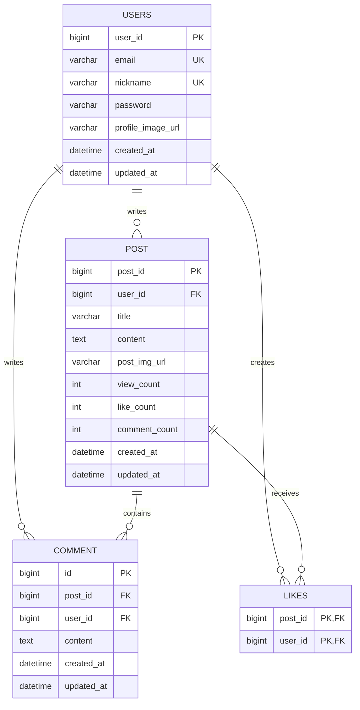

# Talk2Wall Back-end

개발 경험과 일상적인 생각을 나누는 커뮤니티 서비스 **Talk2Wall**의 백엔드 API 서버입니다.  
Spring Boot와 MySQL을 기반으로 회원, 인증, 게시글, 댓글, 좋아요 기능을 구현했으며 JWT 기반의 무상태 인증 방식을 적용했습니다.

## 개발 인원 및 기간

- 개발 기간: 2026.06.02 ~ 2026.08.03
- 개발 인원: 백엔드 1명

## 사용 기술 및 도구

| 구분 | 기술 |
| --- | --- |
| Language | Java 17 |
| Framework | Spring Boot 4, Spring MVC, Spring Data JPA, Spring Security |
| Database | MySQL, HikariCP |
| Query | QueryDSL |
| Authentication | JWT, BCrypt |
| Monitoring | Spring Boot Actuator, Micrometer, Prometheus |
| Deployment | Docker, Docker Compose, Nginx, AWS ECR, GitHub Actions |
| Build | Gradle |

## 폴더 구조

```text
src/main/java/ktb/community
├── common          # 공통 API 응답 형식
├── config          # Security, QueryDSL 설정
├── controller      # HTTP 요청/응답 처리
├── dto             # 요청 검증 및 응답 DTO
├── entity          # JPA 엔티티
├── exception       # 예외 코드 및 전역 예외 처리
├── repository      # JPA·QueryDSL 데이터 접근 계층
├── securiy         # JWT 인증 필터 및 인증 예외 처리
├── service         # 도메인 비즈니스 로직
└── util            # JWT 생성·검증 유틸리티
```

## 서버 설계

계층형 구조로 HTTP 처리, 비즈니스 로직, 데이터 접근의 책임을 분리했습니다. 요청·응답은 DTO로 관리하고, 모든 API는 공통 응답 형식인 `ApiResponse`로 반환합니다.

```text
Client
  ↓
Controller → Service → Repository → MySQL
                ↓
              Entity
```

| 도메인 | Controller | Service | Repository |
| --- | --- | --- | --- |
| 인증 | `AuthController` | `AuthService` | `UserRepository` |
| 사용자 | `UserController` | `UserService` | `UserRepository` |
| 게시글 | `PostController` | `PostService` | `PostRepository` |
| 댓글 | `CommentController` | `CommentService` | `CommentRepository` |
| 좋아요 | `LikeController` | `LikeService` | `LikeRepository` |

## 구현 기능

### 인증 및 사용자

- 이메일·비밀번호 로그인 후 JWT Access Token 발급
- Spring Security와 JWT 필터를 사용한 인증 및 인가
- 회원가입, 프로필 수정, 비밀번호 변경
- 이메일·닉네임 중복 확인 및 입력값 검증
- BCrypt를 이용한 비밀번호 단방향 암호화

### 게시글

- 게시글 생성, 목록 조회, 상세 조회, 수정, 삭제
- 작성자만 수정·삭제할 수 있도록 권한 검증
- 상세 조회 시 조회 수 증가 및 사용자별 좋아요·작성자 여부 제공
- QueryDSL 기반 커서 페이지네이션으로 목록 조회

### 댓글 및 좋아요

- 댓글 생성, 목록 조회, 수정, 삭제
- 댓글 목록의 커서 페이지네이션 및 작성자 정보 조회
- 게시글 좋아요 등록·취소 및 중복 요청 방지
- 좋아요·댓글 수를 게시글에 함께 관리

### 공통 처리 및 운영

- `@Valid` 기반 요청 DTO 검증과 검증 상세 오류 응답
- `ErrorCode`와 `GlobalExceptionHandler`를 통한 예외 응답 일원화
- JPA Auditing으로 생성·수정 일시 자동 관리
- Actuator와 Prometheus용 메트릭 엔드포인트 제공
- Docker 이미지 빌드, GitHub Actions CI/CD, Blue-Green 배포용 Docker Compose 구성

## 데이터베이스 설계



- `users`는 이메일과 닉네임에 유니크 제약을 둡니다.
- `likes`는 `post_id`, `user_id` 복합 키로 한 사용자의 중복 좋아요를 방지합니다.
- `post`는 조회 수, 좋아요 수, 댓글 수를 함께 보관합니다.

## API 요약

| 도메인 | Method | Endpoint | 설명 |
| --- | --- | --- | --- |
| Auth | POST | `/auth/tokens` | 로그인 및 Access Token 발급 |
| User | POST | `/users` | 회원가입 |
| User | PATCH | `/users/profile` | 프로필 수정 |
| User | PUT | `/users/me/password` | 비밀번호 변경 |
| User | GET | `/users?email=` | 이메일 중복 확인 |
| User | GET | `/users?nickname=` | 닉네임 중복 확인 |
| Post | POST | `/posts` | 게시글 생성 |
| Post | GET | `/posts` | 게시글 목록 조회 |
| Post | GET | `/posts/{postId}` | 게시글 상세 조회 |
| Post | PUT | `/posts/{postId}` | 게시글 수정 |
| Post | DELETE | `/posts/{postId}` | 게시글 삭제 |
| Like | POST | `/posts/{postId}/likes` | 좋아요 등록 |
| Like | DELETE | `/posts/{postId}/likes` | 좋아요 취소 |
| Comment | POST | `/posts/{postId}/comments` | 댓글 생성 |
| Comment | GET | `/posts/{postId}/comments` | 댓글 목록 조회 |
| Comment | PUT | `/posts/{postId}/comments/{commentId}` | 댓글 수정 |
| Comment | DELETE | `/posts/{postId}/comments/{commentId}` | 댓글 삭제 |

인증이 필요한 API는 아래 헤더를 포함합니다.

```http
Authorization: Bearer {accessToken}
```

## 로컬 실행

### 1. 환경 변수 설정

애플리케이션 실행 전에 다음 환경 변수를 설정합니다.

```bash
export DB_HOST=localhost
export DB_PORT=3306
export DB_NAME=talk2wall
export USER_NAME=YOUR_MYSQL_USER
export DB_PASSWORD=YOUR_MYSQL_PASSWORD
export JWT_SECRET=YOUR_JWT_SECRET_AT_LEAST_32_BYTES
export EXPIRATION_TIME=3600000
```

### 2. 애플리케이션 실행

```bash
./gradlew bootRun
```

- API 서버: `http://localhost:8080`
- 헬스 체크: `GET /health`
- 관리·모니터링 서버: `http://localhost:9090/actuator`

## 트러블 슈팅 및 개선 과정

### 목록 조회의 성능과 무한 스크롤

게시글과 댓글 목록은 `offset` 방식 대신 ID 기반 커서 페이지네이션을 적용했습니다. 다음 페이지 존재 여부를 판단하기 위해 요청 크기보다 하나 많은 데이터를 조회하고, `nextCursor`와 `hasNext`를 응답에 포함했습니다. 또한 작성자 정보를 함께 조회하는 목록 쿼리에는 QueryDSL의 fetch join을 적용했습니다.

### 인증 예외 응답 통일

JWT 인증 실패도 일반 API 예외와 동일한 형식으로 반환될 수 있도록 `CustomAuthenticationEntryPoint`와 전역 예외 처리기를 구성했습니다. 클라이언트는 성공·실패 여부와 관계없이 일관된 응답 구조를 처리할 수 있습니다.

## CI/CD

```text
main 브랜치 Push
  → GitHub Actions 빌드
  → Docker 이미지 빌드 및 AWS ECR Push
  → talk2wall-manifest Repository의 Values 이미지 태그 갱신
  → Argo CD가 매니페스트 변경 감지
  → 클러스터에 새 이미지 배포
```

- Pull Request가 `main` 브랜치로 생성되면 GitHub Actions에서 Java 17 환경으로 빌드를 검증합니다.
- `main` 브랜치에 푸시되면 Docker 이미지를 빌드해 AWS ECR에 푸시합니다.
- GitHub Actions가 `talk2wall-manifest` 저장소의 `values-image.yaml` 이미지 태그를 새 커밋 SHA로 갱신합니다.
- Argo CD가 매니페스트 저장소의 변경을 감지해 클러스터 배포 상태를 동기화합니다.
